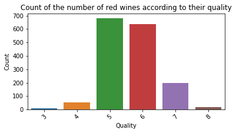
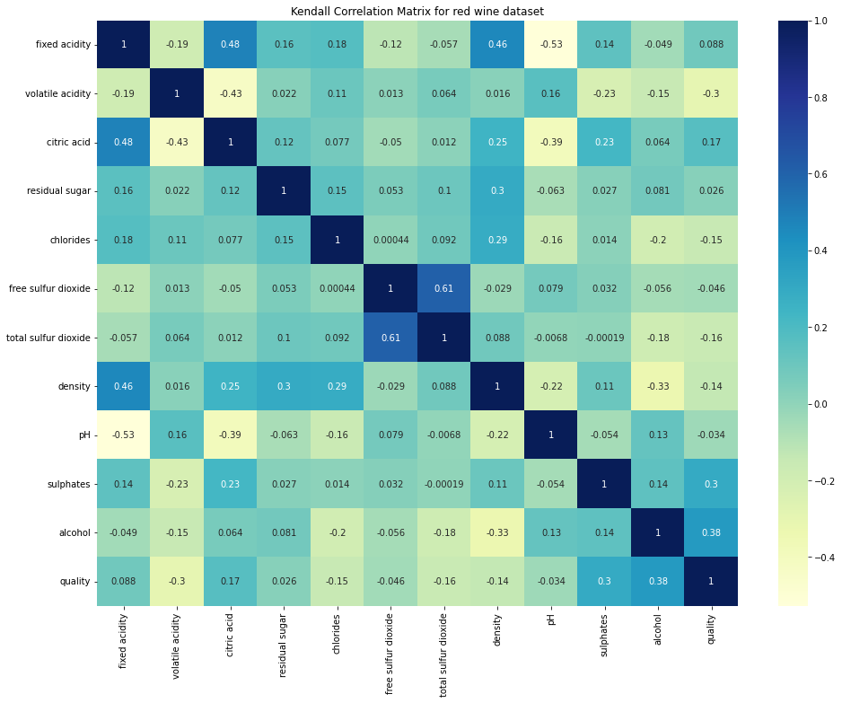
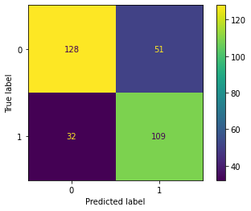
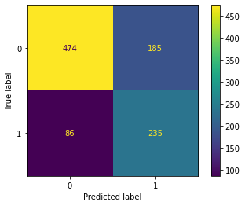
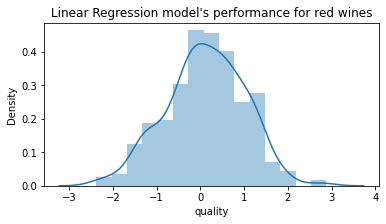
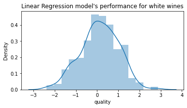

# Wine Quality Prediction Project

This repository contains a Jupyter Notebook for predicting the quality of Portuguese "Vinho Verde" wines using machine learning.

> **Note:** This project was completed as part of a university coursework.

## Contents

- Exploratory Data Analysis (EDA)
- Feature engineering
- Model training and evaluation (classification and regression)
- Visualizations
- Conclusions

## Tech Stack

- Python 3.8+
- Jupyter Notebook
- pandas
- numpy
- seaborn
- scikit-learn
- imbalanced-learn

## Key Visualizations

### Wine Quality Distribution

Red and white wine quality scores are imbalanced, with most samples rated 5 or 6.

### Correlation Heatmaps

Chemical properties show strong correlations, e.g., free/total sulfur dioxide and residual sugar/density.

### Quality by Alcohol Category

Alcohol content is discretized into low, mid, and high. Most wines with mid alcohol content are rated 5 or 6.

### Quality by Sweetness

Sweetness (dry/sweet) is associated with quality. Sweet wines tend to have higher quality scores.

### Model Performance

Confusion matrices for classification models and regression error distributions show model accuracy and error spread.

## Conclusions

- Alcohol and sweetness are moderately correlated with wine quality.
- Highly correlated features (e.g., free/total sulfur dioxide, residual sugar/density) can be dropped to improve model interpretability.
- Logistic Regression and SVM models achieve good accuracy for binary classification of wine quality.
- Linear Regression models provide reasonable predictions for continuous quality scores.
- Hyperparameter tuning and cross-validation help prevent overfitting and improve model reliability.

## Usage

1. Clone the repository.
2. Open the notebook in Jupyter.
3. Run all cells to reproduce the analysis and results.

## Dataset

The notebook uses the publicly available "Vinho Verde" wine quality datasets (red and white) from the UCI Machine Learning Repository.

## License

This project is for educational purposes.
